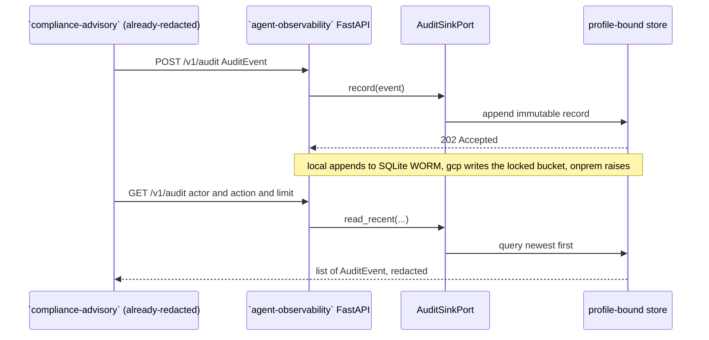

# Architecture: `agent-observability` Agent Observability, Audit & FinOps

Hexagonal ports-and-adapters. The domain core is pure standard library; the one
persistence concern is a port (`AuditSinkPort`); three adapter families implement it and
the active `OBSERVABILITY_PROFILE` binds one. Switching the whole backend is a one-line
profile change, which is the no-lock-in promise (P-02).

## Layers

* **Domain** (`observability.models`, `observability.serialization`): frozen dataclasses
  (`AuditEvent`, `Citation`, `Decision`) and `to_jsonable`. No google-cloud, no framework
  imports.
* **Port** (`observability.ports.audit.AuditSinkPort`): a `@runtime_checkable` Protocol
  (`record` + `read_recent`).
* **Adapters** (`observability.adapters.{gcp,local,onprem}`): each adapter constructs as
  `Adapter(settings: Settings)`. All google-cloud imports are lazy (gcp adapter, and the
  optional Firestore-emulator branch of the local adapter).
* **Config / Container** (`observability.config`, `observability.container`): load
  `config/settings.yaml` with `${ENV:-default}` interpolation and bind each port to a dotted
  path per profile, refusing a profile the map does not name.
  `OBSERVABILITY_PROFILE` is the one exception to that interpolation: it is resolved by
  `config.resolve_profile` in three states, because `${ENV:-default}` cannot distinguish a
  variable nobody set from a deliberate `local`, and the security layers must. `resolve_profile`
  returns which adapters to bind, plus `exposure_profile` (what every relaxation keys off:
  `unconfigured` when nothing was chosen) and `bind_profile` (what the loopback guard keys
  off: `local` when nothing was chosen). It also validates the value, so an unknown or
  mis-capitalised profile is a boot failure rather than a serving app whose exact-match
  posture comparisons all quietly miss. See SPEC section 2 for the state table.
* **Wiring**: the FastAPI app (`observability.api.app`, whose two `/v1/audit` routes require
  service-to-service auth via `api.security.require_service_caller`; `/healthz` stays open)
  and the Typer CLI (`observability.cli.main`). `create_app` also installs the commons
  loopback exposure guard, so a posture with no verified caller authentication is bounded on
  the app object rather than in an entry point the shipped `uvicorn ...:app` command never
  calls (SPEC §6.1). What that guard reads is the CALLER-IDENTITY BINDING and nothing else:
  `src/observability/ports/identity.py` holds what a scheme declares (`VERIFIED` /
  `PRESHARED` / `UNIMPLEMENTED`, with silence and typos read as pre-shared),
  `src/observability/api/security.py` binds one scheme per profile and derives
  `SECURE_PROFILES` from those declarations, and only a binding that declares `VERIFIED`
  stands the guard down. `OBSERVABILITY_S2S_TOKEN` may never enter that decision: while it
  did, SETTING it switched the guard off and a LAN peer holding nothing read `/healthz` and
  the whole capability manifest.

## Profile flow

```mermaid
flowchart LR
  client["`compliance-advisory` remote audit client / CLI / API"] --> app["FastAPI app + Container"]
  app --> port["AuditSinkPort (record, read_recent)"]
  port -->|"profile=gcp"| gcp["CloudLoggingAuditAdapter: locked Cloud Logging WORM bucket, BigQuery FinOps export"]
  port -->|"profile=local"| local["LocalAppendOnlyAuditAdapter: append-only SQLite WORM stand-in, seedable, SDK-free"]
  port -->|"profile=onprem"| onprem["OnPremAuditAdapter: fail-fast Google Distributed Cloud placeholder"]
  local -.->|"opt-in: FIRESTORE_EMULATOR_HOST"| emu["Firestore emulator (lazy google import)"]
```

## Ports and adapters table

| Port | Protocol | gcp adapter | local adapter | onprem adapter |
|---|---|---|---|---|
| audit | `AuditSinkPort` | `gcp.cloud_logging_audit:CloudLoggingAuditAdapter` (locked Cloud Logging bucket, lazy SDK) | `local.audit:LocalAppendOnlyAuditAdapter` (append-only SQLite WORM, seedable, optional Firestore emulator) | `onprem.audit:OnPremAuditAdapter` (fail-fast, `NotImplementedError`) |

The dotted paths in `config/settings.yaml` under `adapters:` are the build contract; the
contract test (`tests/test_adapter_parity.py`) reads them and proves, for both `local` and
`onprem`, that the bound class constructs with a single `Settings` arg and structurally
satisfies the Protocol, that `onprem` is fail-fast, and that `local` is a working WORM
store with page-level citation provenance.

## Request lifecycle (write then read back)



## Data residency and immutability

Every managed resource is pinned to the selected region (default `asia-southeast1`). The `gcp` audit store
is a *locked* Cloud Logging bucket (retention 2557 days, ~7 years): writes are
Write-Once-Read-Many and the bucket cannot be unlocked, so `compliance-advisory` cannot tamper with or delete
its own audit trail. The `local` SQLite stand-in mirrors that guarantee off cloud: SQLite triggers refuse UPDATE
and refuse DELETE outside a recorded retention prune, every record is hash-chained to its
predecessor, and both the chain head and the retention-prune watermark are anchored in an
external file, so a truncated tail and a prefix deletion dressed up as a prune are both
detectable (only while that anchor is held separately from the store). Once the store and
that anchor disagree, appends are refused rather than re-anchored, so the finding survives
the next request instead of being laundered by it. `agent-observability audit verify | export | restore` is the operator surface,
and `src/observability/adapters/local/audit.py` documents exactly which tamper classes are
and are not detected. The `onprem` placeholder raises rather than silently dropping a
record, so a real immutable store must be supplied before that profile ships.

The deployment posture that carries residency is code, not a runbook step: `allowed_regions`
is validated at `terraform plan`, again by the `gcp.resourceLocations` Org Policy for any
create that bypasses Terraform, and a third time by the app at load. A bank-held CMEK is
bound per service, and the VPC Service Controls perimeter ships in dry run with an alert on
its would-be violations, so it is promoted to enforced on evidence rather than on hope.

The `/v1/audit` routes also authenticate the calling service (a Google-signed OIDC ID token
verified against an audience + caller allowlist on `gcp`; a constant-time shared secret on
`local`; `/healthz` open). Only enrolled platform services can write to or read the WORM
trail, reinforcing that a caller cannot reach anyone else's, or tamper with its own, audit
record.
